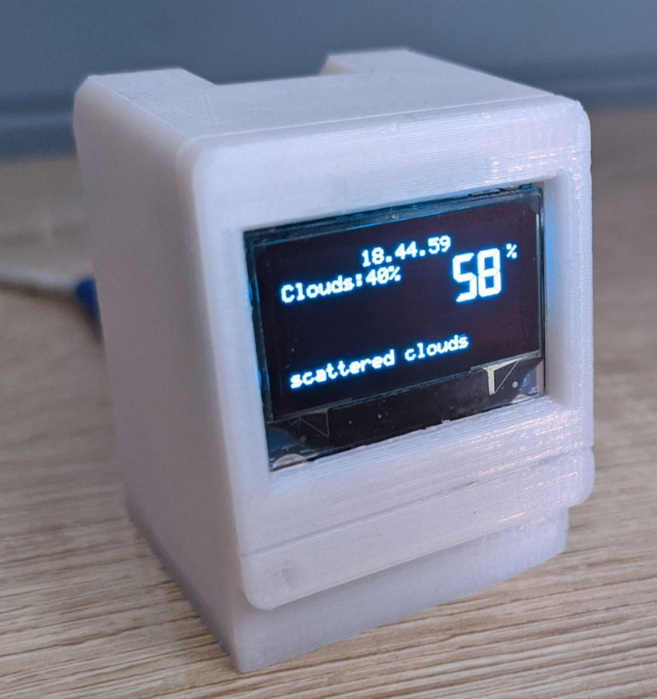
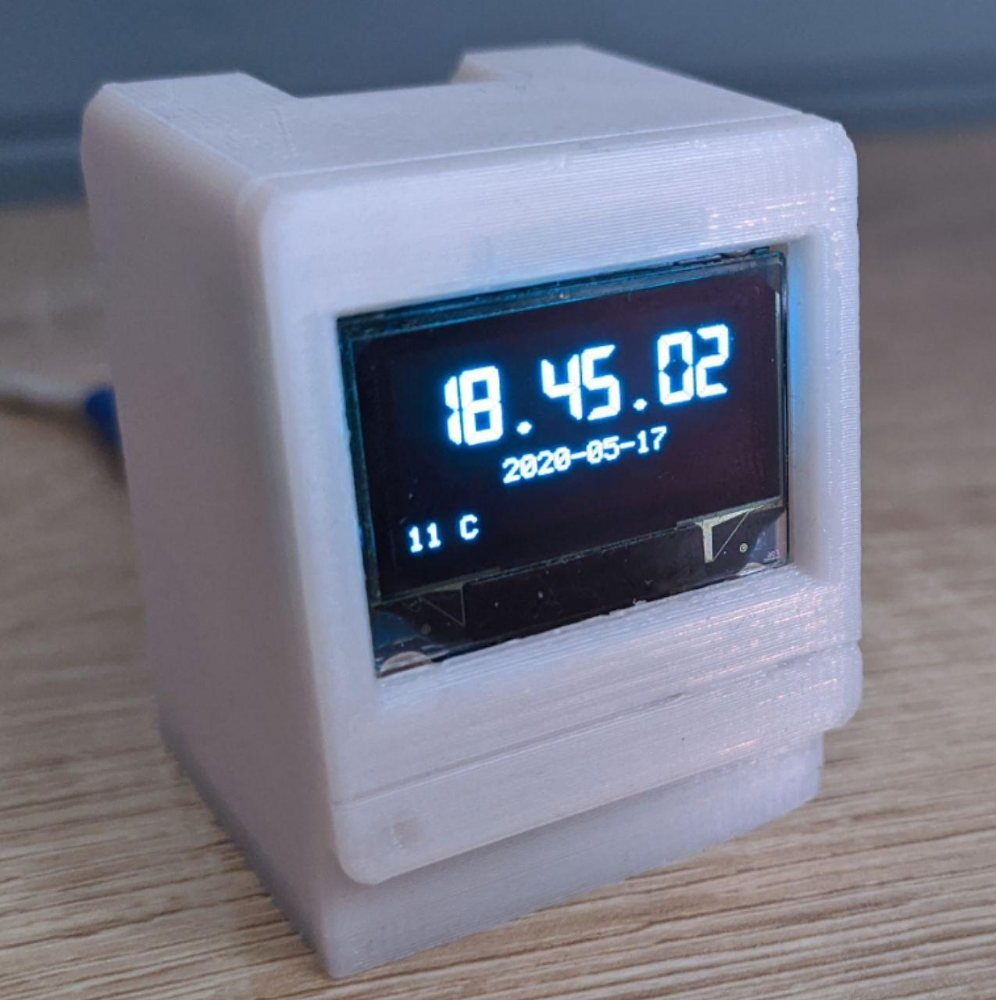
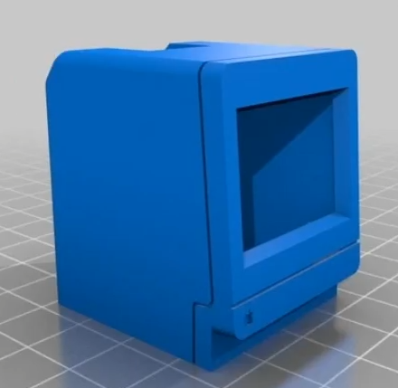
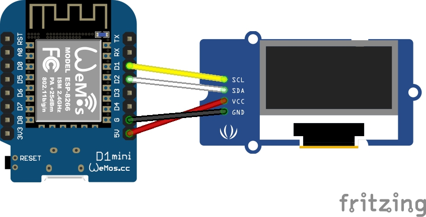
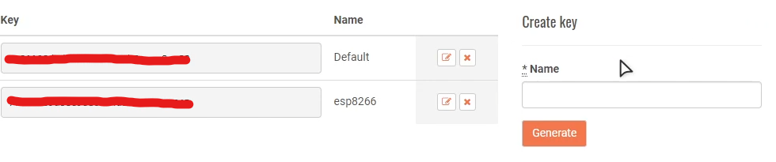
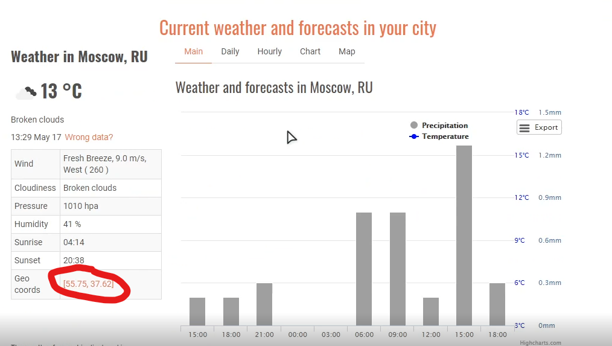

# Умные часы с получением времени и погоды с интернета
Часы умеют показывать время, температуру скорость ветра, влажность, погоду за окном и т.п. В часах есть ночной режим который автоматически включается в заданое в прошивке время. В нем на экран выводится только время в рандомном положении на экране, чтобы не выгорал **OLED** дисплей. 





Чтобы их собрать нам потребуется всего лишь **WeMos D1 mini** и **OLED i2c** дисплей с разрешением 128x64.

Начнем с корпуса. Есть два варианта как его сделать: 

**Первый** вариант - напечатать корпус на 3д принтере.
Я нашел такую [модельку](https://www.thingiverse.com/thing:3548757) в стиле старого мака:



В ней есть специальное место под дисплей и под **esp8266** при желании туда можно было втиснуть аккумулятор, но я этого делать не стал.

А **второй** - обойтись без принтера если сделать корпус из какой-нибудь
пластиковой коробочки, например с [али](https://aliexpress.ru/item/32975561654.html?spm=a2g0o.productlist.0.0.503b125eGU6Y1x&algo_pvid=84b9b87d-59f0-41b4-a5b7-a64efcafd4e0&algo_expid=84b9b87d-59f0-41b4-a5b7-a64efcafd4e0-37).
Она почти идеально подходит под размер дисплея и платы. Единственное китайцы продают их по 5 штук и прийдется проделывать отверстия под разъём платы и под дисплей.

Я сделал корпус по **первому** варианту.
Теперь нам надо спаять дисплей и плату вместе по этой схеме:



Этот проект прост с точки зрения пайки: нам нужно запапять всего лишь **4** провода. Далее вставляем дисплей в специальные пазы в корпусе. 

#### Теперь с программной частью.

Заходим на [openWeatherMap](https://openweathermap.org/) и регистрируемся.

Добавляем новый или используем дефолтный API ключ. Копируем его куда-нибудь он нам потом пригодится.



Теперь на главной странице ищем свой город. Копируем его географические координаты. 



Далее скачиваем **этот** репозиторий.

Теперь устанавливаем поддержку **esp8266**, если у вас ее нет.  [Гайд](https://habr.com/ru/post/371853/)

Устанавливаем библиотеки из папки `libraries`. Там находятся:
- [ArduinoJson-6.x](https://github.com/bblanchon/ArduinoJson)
- [ESP8266HTTPClient](https://github.com/esp8266/Arduino/tree/master/libraries)
- [ESP8266WebServer](https://github.com/esp8266/Arduino/tree/master/libraries)
- [ESP8266wifi](https://github.com/esp8266/Arduino/tree/master/libraries)
- [NTPClient](https://github.com/arduino-libraries/NTPClient)
- OLED_I2C
- [WiFiManager](https://github.com/tzapu/WiFiManager)

Открываем скетч под названием `Web_clock.ino`.
Ищем в нем константу `appid` и в кавычки вставляем API ключ

```c++
const String appid = "xxxxxxxxxxxxxxxxxxxxxxxxxxxxxxxx";
```
Далее в константу `lat` вставляем первое скопированое число, и второе в константу `lon` соответственно.
```c++
const String lat = "xx.xx";
const String lon = "xx.xx";     
```

#### Загружаем прошивку.

При первой загрузке часы зависнут на пункте **autoConnect**. Надо подключится со смартфона или с любого другого устройства и подключить часы к сети. `SSID:Connect-WIFI password:PASSWORD`

Часы запомят WiFi и далее будут подключаться автоматически.

